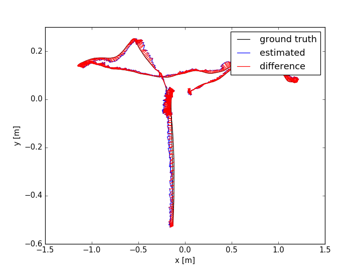
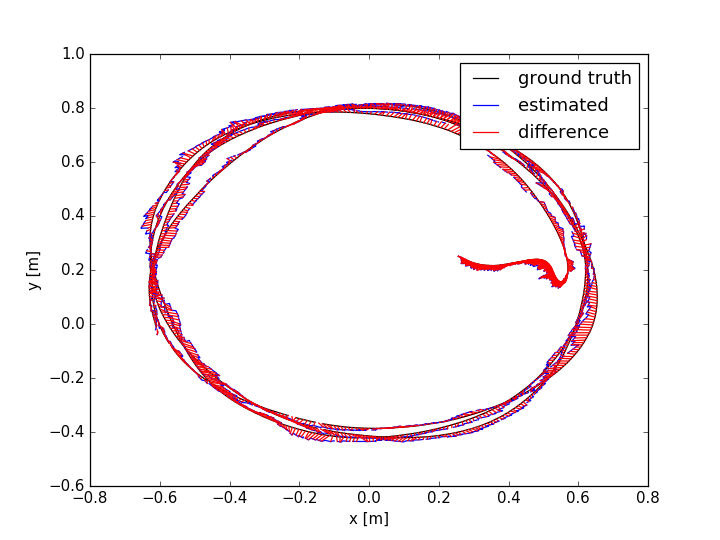

# TOF-VIO

TOF Camera Visual Initial Odometry

**Videos:**

[](https://www.youtube.com/watch?v=IqfIqArsWXA)

**Related Papers:**

### Prerequisites

Ubuntu 16.04

[ROS Kinetic](http://wiki.ros.org/ROS/Installation)

For the experiment platform(optional)
PIXHAWK IMU:
mavros installation
```
    sudo apt-get install ros-kinetic-mavros ros-kinetic-mavros-msgs ros-kinetic-mavros-extras 
```
PMD Flexx TOF-CAMERA:
get [drivers](https://pmdtec.com/picofamily/software/) from the PMD website and install [ros wrapper](https://github.com/code-iai/pico_flexx_driver)

### Dataset
Using our recorded rosbag:

->[Link1](https://drive.google.com/open?id=1gXFkPzBxnanjrGOZI8xY8oLMl_iN59x7) Hand Held Test 

->[Link2](https://drive.google.com/open?id=166c4uA-JcDmmv29gMVxA2dJYKM28NJaI) UAV Test(Changing of environment lighting condition)
The rosbag is [compressed](http://wiki.ros.org/rosbag/Commandline#compress), [depressed](http://wiki.ros.org/rosbag/Commandline#decompress) it before estimation.

Data Format of the rosbag

|   Topic Name  |             Content            | Frequency |
|:-------------:|:------------------------------:|:---------:|
| /image\_depth | Depth image (u,v,z)            |     15    |
| /image\_mono8 | NIR image (u,v,i)              |     15    |
| /points       | Organized point cloud          |     15    |
| /imu          | IMU data                       |    250    |
| /gt           | Ground truth captured by Vicon |     50    |

Camera matrix and distortion coeffs of the Depth/NIR image

| camera matrix |           | distortion coeffs |         |
|---------------|-----------|-------------------|---------|
| fx            | 211.95335 | k1                | 0.57858 |
| fy            | 211.95335 | k2                | -5.7317 |
| cx            | 115.6517  | p1                | 0       |
| cy            | 87.125724 | p2                | 0       |
|               |           | p3                | 10.0098 |

### Build and Run

Build
```
catkin_make
```

Run
```
source catkin_ws/devel/setup.bash 
roslaunch vio vio.launch
```
### Evaluation 
TUM scripts can be used to evaluate the result, the following are the exported of rosbag result:

Handheld test



UAV test



